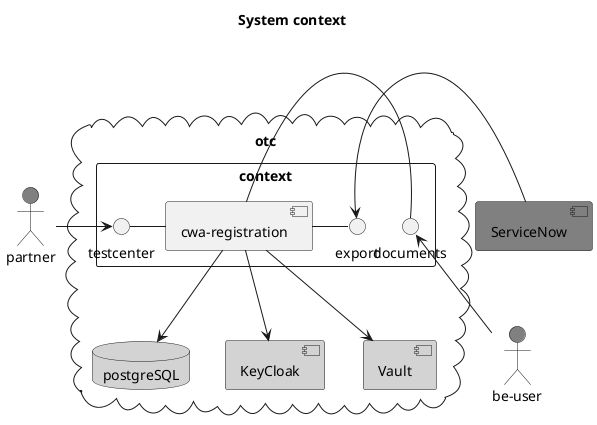

# CWA Testcenter registration 
- Registration website
  - https://registrierung.schnelltestportal.de
  - input necessary data to register a new ~~testcenter~~ as of 21.07. only partner registrations are required 
- Exportservice
  - ~~as of 16.07. export has to be secured with Basic Auth~~
  - as of 28.07. keycloak authentication is mandatory
  - as of 22.07. created as ISO formatted timestamp
  - add UTF-8 with BOM to exported csv
  - download all uploaded files via http as one zip file
- Database access via HashiCorp Vault (provided)

## Requirements/Validation
- unique email address
- Required fields:
  - E-Mail für Kontakt
  - Name Teststelle/Betreiber 
  - Adresse: Straße, PLZ, Ort
  - Häkchen für RAT-Nachweis 
  - Software vorhanden (ja  Auswahl verfügbare Partner; nein  Portal)
- Optional fields
  - Ansprechpartner;Telefonnummer;
  - Teststellen-ID,
  - Häkchen für Arzt oder Apotheker; 
  - Betriebene Testcentren; 
  - Anzahl Tests pro Tag
  
# CWA Export function
- CSV Export per http(s)
- Basic Authentication for Export 

## Systemcontext




## Development
- run local vault instance
```shell
  set VAULT_ADDR=http://localhost:8200
  vault partner init
  vault secrets enable -path=secret/ kv
  vault kv put secret/cwa-registration \ 
    spring.datasource.username=testcenter \
    spring.datasource.password='#Telekom01' \
    spring.datasource.url=jdbc:postgresql://localhost:5432/testcenter
```
  
- run local postgresql instance:
<code>docker run -it --rm --network some-network postgres psql -h some-postgres -U postgres</code
 ```sql
  CREATE USER testcenter WITH PASSWORD '#Telekom01';
  CREATE DATABASE testcenter;
  GRANT ALL PRIVILEGES ON DATABASE testcenter TO testcenter;
 ```

- run local keycloak instance
```docker run -p 8080:8080 jboss/keycloak```
```docker exec <CONTAINER> /opt/jboss/keycloak/bin/add-user-keycloak.sh -u <USERNAME> -p <PASSWORD>```
```docker restart <CONTAINER>```

- create new realm `cwa-registration`
- create client `cwa-registration`
- create client roles `CWA_CSV_EXPORT_USER` and `CWA_ATTACHMENT_EXPORT_USER`
- create users and assigne roles

### Database
```plantuml source="src/main/doc/database.puml" 
```

### Configuration
|Key| Description|
---|---
|PostreSQL Datasource|
|```spring.datasource.url```| JDBC connection string |
|```spring.datasource.username```| database user |
|```spring.datasource.password```| database password |
|Registration Application|
|```config.downloadUrl```| URL for downloading attached documents.|
|```config.role.attachment_export```| "CWA_ATTACHMENT_EXPORT_USER"|
|```config.role.partner_export```| "CWA_CSV_EXPORT_USER"|
|```config.solution-file-location```| Path to file containing registered test software solutions |
|```config.role.partner_export```| Keycloak role for partner csv export |
|```config.role.attachment_export``` | Keycloak role for document download |
|KeyCloak|
|```keycloak.realm``` | cwa-registration |
|```keycloak.credentials.secret```| Client secret|
|```keycloak.auth-server-url``` | http://localhost:8180/auth|
|```keycloak.resource```| cwa-registration
|```keycloak.ssl-required```| external|
|```keycloak.use-resource-role-mappings```|true|

## Usage
1. Registration: https://<server>:<port>/partner/new 
2. Export: https://<server>:<port>/partner/export[?since=yyyy-MM-ddThh:mm]
```curl -i -u admin:top_secret http://localhost:8080/partner/export```
3. Document bundle download: https://<server>:<port>/partner/export/attachment?id=[UUID]
  ```curl -i -u admin:top_secret http://localhost:8080/partner/export/attachment```
  
## How to contribute
Contribution and feedback is encouraged and always welcome. For more information about how to contribute, the project structure, as well as additional contribution information, see our [Contribution Guidelines](./CONTRIBUTING.md). By participating in this project, you agree to abide by its [Code of Conduct](./CODE_OF_CONDUCT.md) at all times.

## Contributors
The German government has asked SAP AG and Deutsche Telekom AG to develop the Corona-Warn-App for Germany as open source software. Deutsche Telekom is providing the network and mobile technology and will operate and run the backend for the app in a safe, scalable and stable manner. SAP is responsible for the app development, its framework and the underlying platform. Therefore, development teams of SAP and Deutsche Telekom are contributing to this project. At the same time our commitment to open source means that we are enabling -in fact encouraging- all interested parties to contribute and become part of its developer community.

## Licensing
Copyright (c) 2020-2022 Deutsche Telekom AG.

Licensed under the **Apache License, Version 2.0** (the "License"); you may not use this file except in compliance with the License.

You may obtain a copy of the License at https://www.apache.org/licenses/LICENSE-2.0.

Unless required by applicable law or agreed to in writing, software distributed under the License is distributed on an "AS IS" BASIS, WITHOUT WARRANTIES OR CONDITIONS OF ANY KIND, either express or implied. See the [LICENSE](./LICENSE) for the specific language governing permissions and limitations under the License.
